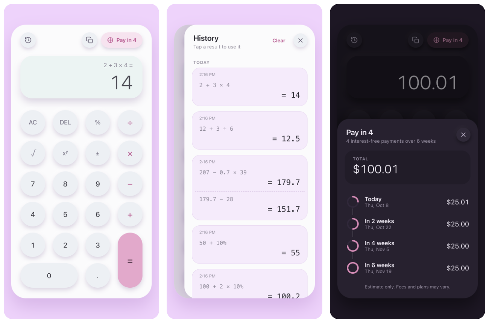

# Calculator: React + Go

A full-stack calculator. The **React + TypeScript** frontend handles input and display, and every arithmetic step runs on a **Go** REST microservice.



## Features

| | |
| --- | --- |
| **Operations** | Add, subtract, multiply, divide, plus the optional power, square root and percentage |
| **Correct math** | Operator precedence: `2 + 3 × 4 = 14`, `2 ^ 3 ^ 2 = 512` |
| **Percent** | Works like a phone calculator: `50 %` → 0.5, `50 + 10 % =` → 55 |
| **Pay in 4** | Splits the number on screen into 4 payments, one today and one every 2 weeks, exact to the cent |
| **History** | Saved calculations; continued calculations share a card; tap a result to reuse it |
| **Polish** | Keyboard support, copy result, light/dark theme, works on phones |

## Getting started

### With Docker (recommended)

```bash
docker build -t sezzle-calculator .
docker run --rm -p 8080:8080 sezzle-calculator
```

Open **http://localhost:8080**. One Go process serves both the API and the frontend.

### Without Docker

Requires **Go 1.24+** and **Node.js 20.19+ or 22.12+**. Use two terminals:

```bash
# Terminal 1: API on :8080
cd backend && go run ./cmd/server

# Terminal 2: UI on :5173 (proxies /api to :8080)
cd frontend && npm ci && npm run dev
```

Open **http://localhost:5173**.

### Tests and coverage

```bash
cd backend  && go test -race -cover ./...
cd frontend && npm run coverage      # HTML report: frontend/coverage/index.html
```

| Layer | Tests | Coverage |
| --- | --- | --- |
| Backend | Table-driven unit tests and HTTP tests through the router | **91.9%** of statements (`calculator` and `installments` 100%, `api` 99%) |
| Frontend | 165 unit and integration tests (the full UI against a fake backend) | **99.5%** of lines |

CI runs linting, type checks and both test suites on every push.

## API

All endpoints accept and return JSON. The full contract is in [`backend/api/openapi.yaml`](backend/api/openapi.yaml).

| Endpoint | Body | Result |
| --- | --- | --- |
| `POST /api/v1/add` · `subtract` · `multiply` · `divide` · `power` | `{"a": 6, "b": 3}` | a ⊕ b |
| `POST /api/v1/percentage` | `{"a": 10, "b": 50}` | a% of b → `5` |
| `POST /api/v1/sqrt` | `{"a": 81}` | √a → `9` |
| `POST /api/v1/installments` | `{"amountCents": 10001}` | 4 payments, every 14 days |
| `GET /healthz` | | `{"status": "ok"}` |

```bash
curl -X POST localhost:8080/api/v1/divide -d '{"a": 10, "b": 4}'
# 200 {"operation":"divide","a":10,"b":4,"result":2.5}

curl -X POST localhost:8080/api/v1/divide -d '{"a": 1, "b": 0}'
# 422 {"error":{"code":"DIVISION_BY_ZERO","message":"division by zero is undefined"}}

curl -X POST localhost:8080/api/v1/installments -d '{"amountCents": 10001}'
# 200 {"amountCents":10001,"count":4,"intervalDays":14,"payments":[
#       {"number":1,"dueInDays":0,"amountCents":2501}, {"number":2,"dueInDays":14,"amountCents":2500},
#       {"number":3,"dueInDays":28,"amountCents":2500}, {"number":4,"dueInDays":42,"amountCents":2500}]}
```

Errors always have the shape `{"error": {"code", "message"}}`:

| Status | When |
| --- | --- |
| **400** `INVALID_REQUEST` | Malformed JSON, missing or non-numeric operand, unknown field |
| **404** `UNKNOWN_OPERATION` | Operation doesn't exist |
| **422** | Valid request with no answer: `DIVISION_BY_ZERO`, `NEGATIVE_SQUARE_ROOT`, `UNDEFINED_RESULT`, `RESULT_OUT_OF_RANGE`, `AMOUNT_TOO_SMALL`, `AMOUNT_TOO_LARGE` |

## Design decisions

- **Backend does all the math.** For `2 + 3 × 4`, the frontend applies precedence and asks the API for `3 × 4`, then `2 + 12`. Each operation stays a simple, testable endpoint.
- **Layered Go service on the standard library only.** `internal/calculator` and `internal/installments` hold pure logic with no HTTP knowledge; `internal/api` only translates between JSON and that logic. A test keeps the OpenAPI spec in sync with the routes.
- **Money in integer cents.** Pay in 4 never uses floats, so payments always add up to the exact total. Leftover cents go to the first payment: $100.01 becomes $25.01 + 3 × $25.00.
- **Strict validation.** Missing operands are caught, never treated as `0`. Unknown fields and oversized bodies are rejected, and results are always finite numbers.
- **Testable frontend.** The calculator state is a pure reducer; hooks handle API calls; components only render. Key labels, shortcuts and actions are defined once in `keys.ts`.

## Assumptions

- **Pay in 4** is a planning estimate based on the usual Pay in 4 model: 25% today, then every 2 weeks, no interest. Real plans may require a larger first payment or charge fees, and the UI says so.
- **Numbers** use float64, accurate to about 15 significant digits. The display rounds to 15, so `0.1 + 0.2` shows `0.3`.
- **History** is stored in the browser (last 100 calculations).
- **Parentheses** aren't supported. Precedence covers the expected cases without them.

## Project structure

```
backend/
  api/openapi.yaml        API contract
  cmd/server/             Entry point: config, graceful shutdown
  internal/calculator/    Arithmetic
  internal/installments/  Pay in 4 split, in cents
  internal/api/           HTTP handlers and validation
frontend/src/
  calculator/             Pure logic: reducer, precedence, formatting, history
  hooks/                  State + API: useCalculator, useHistory, useInstallments
  components/             UI
  api/                    Typed API client
```

---

Built with Claude Code. The prompts I used are in [PROMPTS.md](PROMPTS.md).
